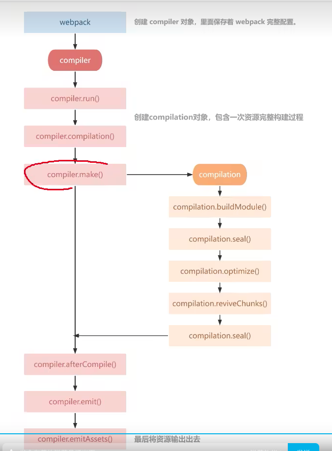

### 什么是webpack
> webpack 是一个打包模块化的JavaScript的工具，它会从入口模块出发，识别出源码中的模块化导入语句，
递归的找出入口文件的所有依赖，将入口和其他所有的依赖打包到一个单独的文件中

1. webpack是基于nodejs的,所以要基于CommonJS规范导出一个对象
2. webpack不适用于构建JavaScript库，因为不够纯碎，会打包出来一个bootstrap函数

### webpack5新特性
1. 内置清除输出目录 clean: true
2. 更优雅的处理资源模块 assetModuleFilename
3. 打包体积优化 -> 深度嵌套的tree-shaking
4. 将4的cache-loader进行了内置，默认开启，或者配置cache
5. 模块联邦 - 微前端
### 构建流程

一个 compilation 对象会对构建依赖图中所有模块，进行编译。 在编译阶段，模块会被加载(load)、封存(seal)、优化(optimize)、 分块(chunk)、哈希(hash)和重新创建(restore)
1. compile 开始编译
2. make 从入口点分析模块及其依赖的模块，创建这些模块对象
3. build-module 构建模块
4. seal 封装构建结果
5. emit 把各个chunk输出到结果文件

https://blog.csdn.net/liu19721018/article/details/125763634

### Plugins
Plugins可以在webpack运行到某个阶段的时候，帮你做一些事情，类似于生命周期的概念。扩展插件，在webpack构建流程中的特定时机注入扩展逻辑来改变构建结果或者你想做的事情。
作用于整个构建过程

站在代码角度：webpack在编译过程中，会广播事件，触发一系列Tapable（webpack核心功能库，提供了各种钩子）钩子事件，插件所做的，就是找到相应的钩子，往上面挂载自己的任务，也就是注册事件。webpack在构建的时候，插件注册的事件就会随着钩子的触发而执行了

> Plugin:开始打包，在某个时刻，帮助我们处理一些什么事情的机制
plugin要比loader稍微复杂一些，在webpack的源码中，用plugin的机制还是占有非常大的场景，
可以说plugin是webpack的灵魂
设计模式
  事件驱动  发布订阅
plugin是一个类，里面包含一个apply函数，接收一个参数，compiler

### Loaders
- 同步loader
- 异步loader: 会产生阻塞，当我们想拿到异步操作的结果传递给下一个loader时候，可以用异步loader，否则会传给下一个loader一个undefined
- row loader ：content返回的是二进制数据，处理图片和字体等文件
- pitch loader： pitch优先执行，一但有返回值，就不会执行后面loader，提供熔断机制
  
> babel-loader 负责和webpack搭建桥梁
babel-core 是核心代码，提供很多api，转ast语法树等
babel-preset-env 负责真正的转换工作，兼容各版本的语法特性，把es6转es5，但是支持的并不全
babel-polyfill 提供更多语法转换 -> 现在已废弃，被corejs/stable取代
``` C
/**
 *
 * @param content 源文件的内容
 * @param {object} [map] 可以被 https://github.com/mozilla/source-map 使用的 SourceMap 数据
 * @param {any} [meta] meta 数据，可以是任何内容, 其他loader传递过来的数据
 */
module.exports = function webpackLoader(content, map, meta) {
  // 你的 webpack loader 代码
}
```

多页面打包 ：entry可以定义一个对象，plugins可以写多个htmlWebpackPlugins

- ##### module chunk bundle 区别
  module，chunk 和 bundle 其实就是同一份逻辑代码在不同转换场景下的取了三个名字，我们直接写出来的是 module，webpack 处理时是 chunk，最后生成浏览器可以直接运行的 bundle。
   > https://www.cnblogs.com/skychx/p/webpack-module-chunk-bundle.html

- ##### compiler 和 compliation 区别
 不同点是 Compiler 是每个 Webpack 的配置，对应一个 Compiler 对象，记录着整个 Webpack 的生命周期；在构建的过程中，每次构建都会产生一次Compilation，Compilation 则是构建周期的产物。

 compiler对象是一个全局单例，他负责把控整个webpack打包的构建流程。compilation对象是每一次构建的上下文对象，它包含了当次构建所需要的所有信息，每次热更新和重新构建，compiler都会重新生成一个新的compilation对象，负责此次更新的构建过程

 https://blog.csdn.net/weixin_42614080/article/details/110507675
 
> 参考链接 
>  1. 面试题 https://mp.weixin.qq.com/s/wm_7RvwIQxSow2K5IxZDvw
>  2. b站基础知识点 http://www.woc12138.com/article/45
>  3. b站进阶知识点 https://juejin.cn/post/6909719159773331463/#heading-7


### 构建性能优化  
1.减少loader处理，给loader配置include（实质上就是减少对文件的处理）
2.配置noparse选项（如jqery,lodash等模块在生产环境直接引用cdn地址）
3.ignorePlugin忽略一些不需要的模块（如moment里面的国际化模块） 
>https://www.bilibili.com/video/BV1Pf4y157Ni?p=52&spm_id_from=pageDriver
4.DllPlugin第三方不容易变动的库单独打包成动态链接库 （先用DllPlugin构建出dll和manifest文件，再用DllReference插件建立引用）

  
### rollup
1. 小巧、提供一个充分利用esModule特性的高效打包器 
2. 插件
rollup-plugin-json：直接读取json模块
rollup-plugin-node-resolve：rollup默认只能按照文件路径记载本地模块，配置这个插件，直接像引入即可，来加载npm模块 
import _ from 'lodash-es' // 默认只支持esModule版本
rollup-plugin-commoinjs：支持cjs的模块的记载
3. 优点：
   输出结果更加扁平
   tree-shaking
   打包结果依然完全可读
4. 缺点
   加载非ESM的第三方库比较复杂，要引入插件
   模块最终都被打包到一个函数中，无法实现HMR
   浏览器环境中，代码拆分功能依赖AMD库
   