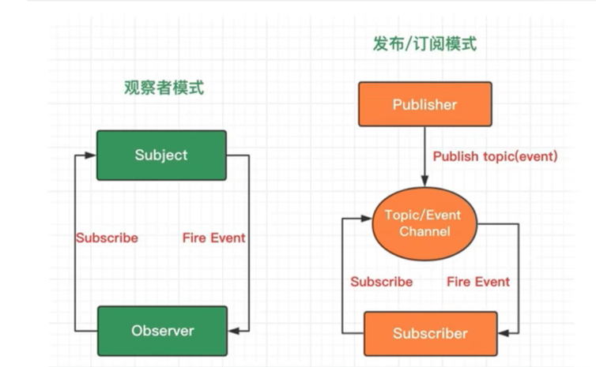

### 观察者模式和发布发布订阅模式区别

**观察者模式**：观察者（Observer）直接订阅（Subscribe）主题（Subject），当主题呗激活的时候，会触发（Fire Event）观察者里的事件
**发布订阅模式**：订阅者（Subscriber）把自己想订阅的事件注册（Subscribe）到调度中心（Topic），当发布者（Publisher）发布该事件（Publish topic）到调度中心，也就是该事件触发时，由调度中心统一调度（Fire Event）订阅者注册到调度中心的处理代码

从表面上看：
1. 观察者模式里，只有两个角色 —— 观察者 + 被观察者
2. 而发布订阅模式里，却不仅仅只有发布者和订阅者两个角色，还有一个经常被我们忽略的 —— 经纪人Broker
往更深层次讲：
1. 观察者和被观察者，是松耦合的关系
2. 发布者和订阅者，则完全不存在耦合
从使用层面上讲：
1. 观察者模式，多用于单个应用内部
2. 发布订阅模式，则更多的是一种跨应用的模式(cross-application pattern)，比如我们常用的消息中间件
https://zhuanlan.zhihu.com/p/51357583

### 平时遇到的设计模式
1. axios里面cancelToken取消重复请求用到发布订阅模式、webpack的插件中用到的Tapable模块
2. webpack中loader处理文件用到的单一职责模式
3. react里面高阶组件用到的装饰器模式