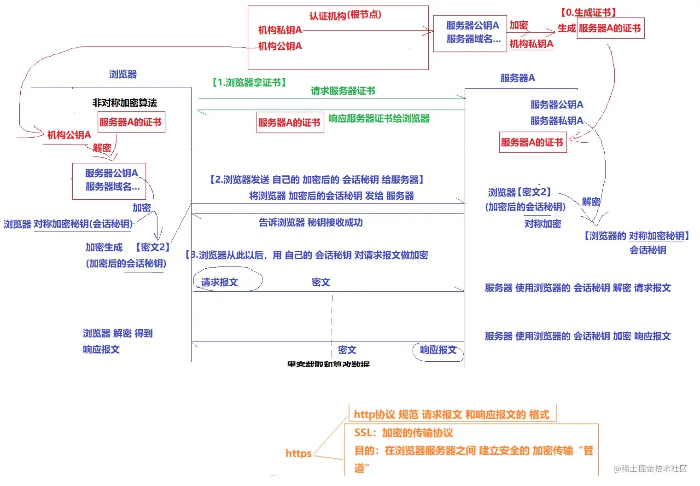

##### NDS劫持
DNS劫持是指在劫持的网络范围内拦截域名解析的请求，分析请求的域名，把审查范围以外的请求放行，否则返回假的IP地址或者什么都不做使请求失去响应，其效果就是对特定的网络不能反应或访问的是假网址。
##### HTTP劫持
-  H5的恶意注入广告
   https://blog.csdn.net/qq_34815528/article/details/78464455
HTTP劫持是在使用者与其目的网络服务所建立的专用数据通道中，监视特定数据信息，提示当满足设定的条件时，就会在正常的数据流中插入精心设计的网络数据报文，目的是让用户端程序解释“错误”的数据，并以弹出新窗口的形式在使用者界面展示宣传性广告或者直接显示某网站的内容。
解决方法：
1. 开启https

##### http协议的了解（包含那些内容？）
   请求报文（请求行 消息报头 请求正文）
   响应报文 (状态行 消息报头 响应正文)
   Content-type -> Body的编码方式 https://www.cnblogs.com/fixdq/articles/9337926.html
   应用层（HTTP,DNS） 传输层(TCP,UDP) 网络层(IP,ARP) 链路层(PPP)
-  网络协议知识点 https://juejin.cn/post/6939691851746279437
-  TCP相关知识 https://juejin.cn/post/6844904070889603085

### http缓存
https://www.cnblogs.com/echolun/p/9419517.html
cache-control
- no-store 不使用缓存
- no-cache 使用缓存，但是每次使用缓存之前看看是否是最新 
- max-age 设置过期相对时间
1. max-age的优先级比Expries优先级高
2. 强缓存是指浏览器在加载资源时，根据请求头Expires和cache-contorl判断是否命中客户端缓存
3. 强制缓存未成功走协商缓存 
   （if-Modified-Since/Last-Modify）只能精确到秒，如果是1s内发上变化无法感知
   所以用更精确的（if-none-match/etag）对比，如果相等，命中缓存，返回304状态码
   etag优先级大于Last-Modify

### http2.0比1.0优势
1. 二进制传输数据
2. 服务器主动推送
3. 头部压缩（只发送差异的头部数据）
4. 多路复用（能同时收到多个请求，http1只能6个）
   
### https协议原理
https://juejin.cn/post/7036551179517558791
https://ruanyifeng.com/blog/2014/02/ssl_tls.html

1. 生成证书：用机构私钥加密（服务器公钥和服务器域名）生成服务器证书
2. 浏览器请求拿到证书，再用机构公钥解密得到（服务器公钥和服务器域名）
3. 将对程加密的密钥（也称会话密钥）使用非对称加密的公钥（即服务器公钥）进行加密，然后发送给服务器，
   服务器使用私钥（服务器私钥）解密得到对称加密的密钥
4. 然后双方可以用对称加密来沟通

##### 常见安全漏洞
1. sql注入 （预编译sql语句，然后执行）
2. 恶意文件上传 （校验上传的文件资源属性，过滤文件后缀扩展名，随机生成文件名，禁止应用静态资源目录执行动态脚本）
3. 跨站脚本攻击（xss）（url的encode，cookie设置http-only, 返回的脚本转成html实体） https://www.jianshu.com/p/4fcb4b411a66
   - 反射型
   - 存贮型
   - DOM型
4. 防止前置条件绕过 （一些重要的业务逻辑得放在后端校验）
5. 用户水平越权 （如订单查询，得校验id是否属于当前用户）

##### 用户输入url 
1. 用户输入 baidu.com  （url解析，判断是否是个合法ur）
2. 浏览器通过DNS，把url解析程ip（ DNS进行域名解析，解析过程中，有个逐步读取缓存策略，直到拿到ip地址）
3. 和ip地址建立TCP链接，发送http请求
4. 服务器接受请求、查库、读文件等、拼接好返回http响应
5. 浏览器收到首屏html，开始渲染
6. 解析html为dom （加载额外的css和js）
7. 解析css为css-tree
8. dom+css 生成render-tree 进行绘图

 传输层建立tcp链接，传输数据之前建立联系，（http协议只是tcp协议的一部分）连接过程中会发生三次握手
  https://www.cnblogs.com/engeng/articles/5959335.html
***（三次握手：就是建立http请求之前需要先建立TCP链接，建立TCP链接的时候客户端和服 务器端发生的三次对话，
  1 先是客户端发送消息给服务器端说要建立连接，此时并不携带数据。
  2 服务器端收到消息表示可以建立连接，再发送消息给客户端，表示收到请求，等待链接。
  3 客户端收到确认消息时候在此确认，并携带需要发送给服务器的消息，建立连接）***

**总结：**（URL解析 DNS查询 TCP连接 处理请求 接受响应 渲染页面）

(模型角度)
- 网络七层模型 （物理层，数据层）网络层（ip）传输层（tcp 安全可靠、分段传输，udp 丢包） （会话层 表现层 应用层）http
1. 先查找缓存，检测缓存是否过期，没有直接返回缓存内容
2. DNS解析 看域名是否被解析过，DNS协议，将域名解析成ip地址 （DNS基于UDP）
3. 如果请求是https SSL协商
4. ip地址用来寻址，排队等候，最多能同时发送6个http请求
5. 创建tcp链接 用于传输（过程中三次握手）
6. 利用tcp传输数据 （拆分成数据包 有序、可靠） 服务器会按照顺序来接受
7. 发送http请求 （请求头 请求行 请求体）http请求keep-alive，默认不会断开， 为了下次传输数据时，可以复用上次的链接
8. 服务器收到数据后（响应行 响应头 响应体）
   301 永久重定向 302 临时重定向 304 查询浏览器缓存进行返回

##### 一个请求有哪些时间消耗
https://senior-frontend.pages.dev/computerNetwork/tools.html#_5-5-1-%E7%BD%91%E7%BB%9C%E4%BC%98%E5%8C%96%E6%8C%87%E6%A0%87
1. **Resource Scheduling（资料调度）** 浏览器同时处理很多请求，发送一个请求不是立即去发，是有一个调度过程的；浏览器也不是同时无限制的发送请求，浏览器对于一个运营项发送6个请求，其实6个已经很多了， 现在是一个http2.0的时代；其实建立一个连接，可以传送很多数据，也不一定像过去那样多发几个请求了；虽然是http2.0时代，也是有一定限制的，一次也不会请求太多数据。
2. **Connection Start （建立连接）**
- stalled （闲置时间，程序准备工作）
- DNS Lookup （DNS查询时间）
- initial connection （TCP建立连接，3次握手）
- SSL （三次握手的时候，也会把ssl层建立起来，所以三次握手和ssl层有重叠，黄色部分和紫色部分）
3. **Request/Response （收发请求）**
- Request sent 发请求
- Waiting（TTFB）（第一个字节返回，耗时的大开销在网络延迟也有服务端的处理，用了91.94ms）
- Content Download （下载）
